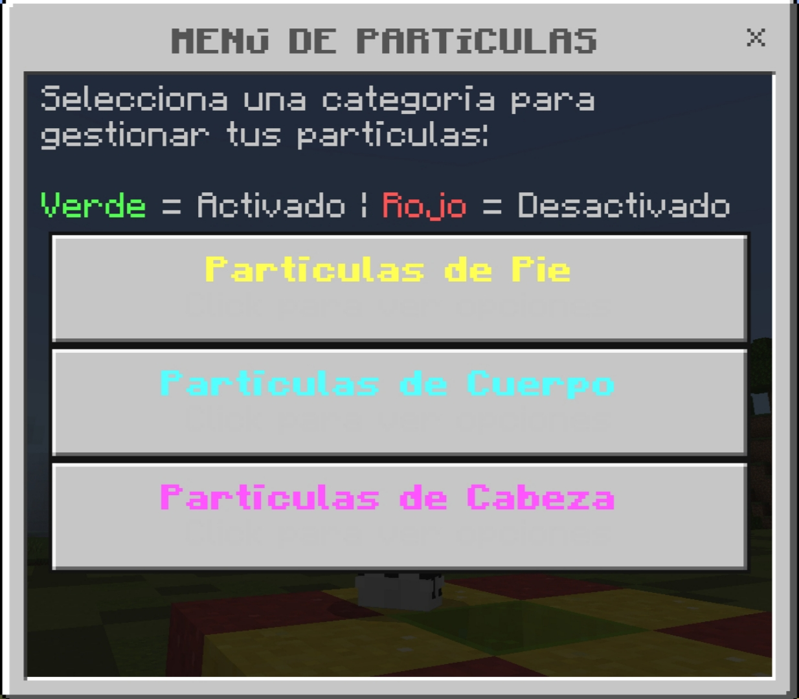
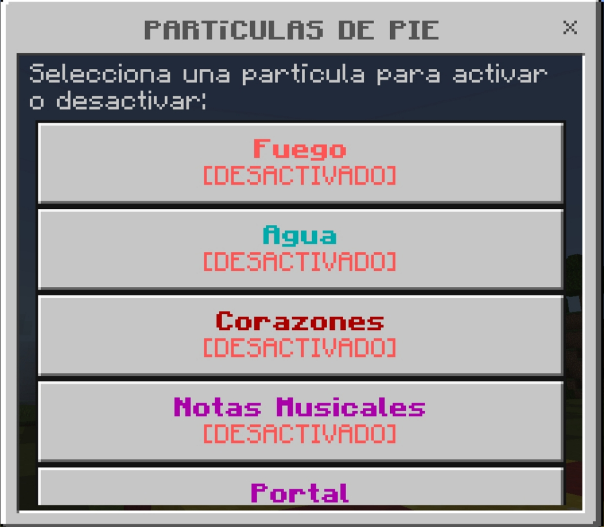
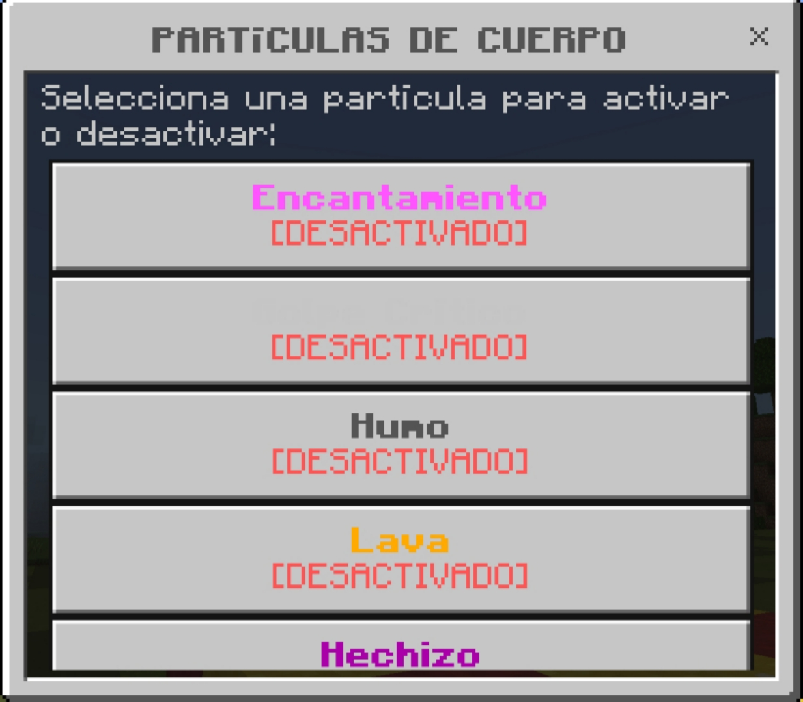
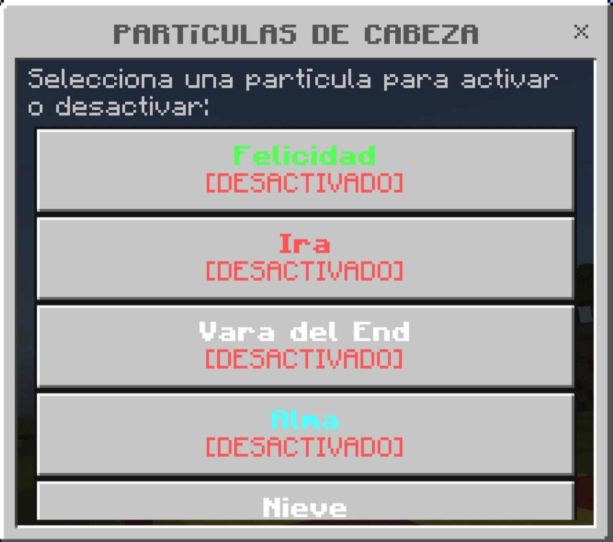
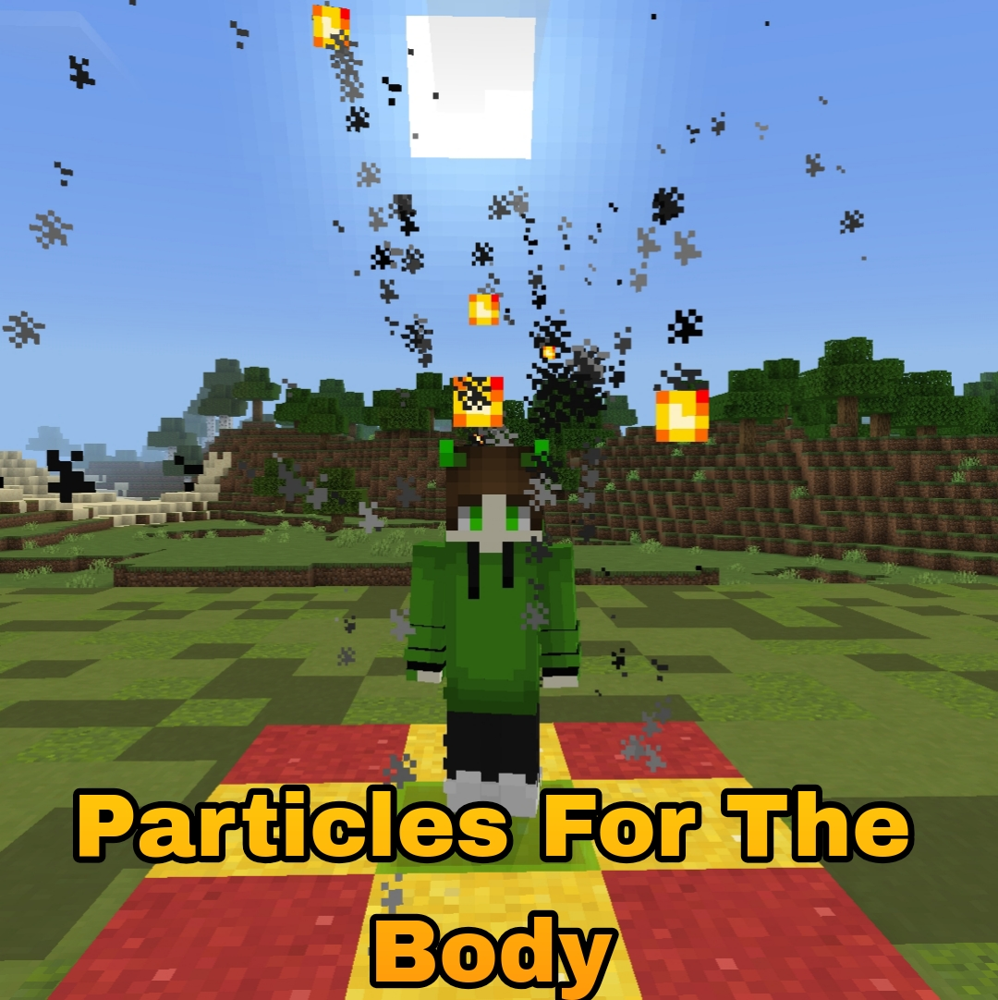
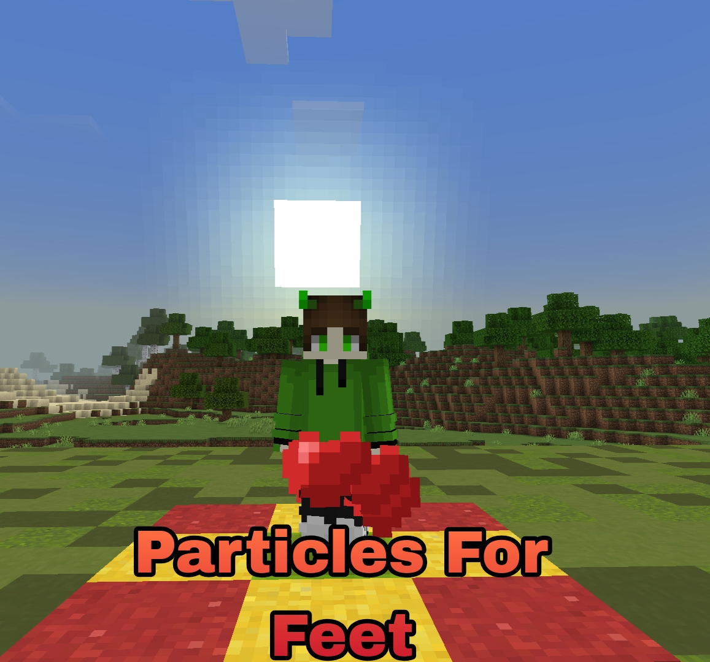
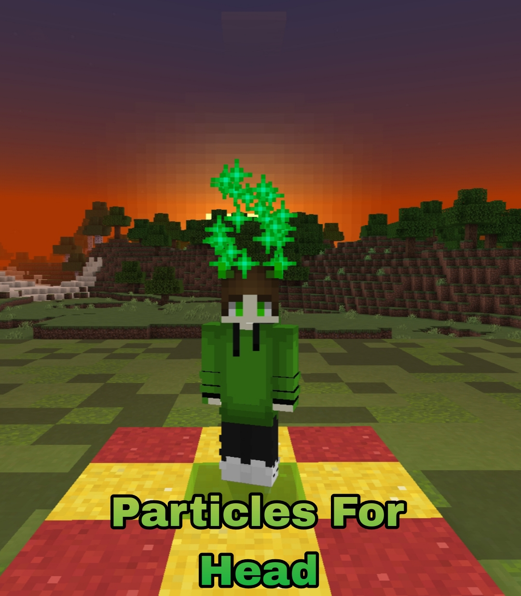

# 🎆 Particles v1.0.0

**Sistema avanzado de partículas para PocketMine-MP API 5.0.0**

[](https://pmmp.io)
[](https://php.net)
[](LICENSE)

---

## ✨ Características

- **🦶 5 Partículas de Pie** - Fuego, Agua, Corazones, Notas Musicales, Portal
- **👤 5 Partículas de Cuerpo** - Encantamiento, Golpe Crítico, Humo, Lava, Hechizo  
- **👤 5 Partículas de Cabeza** - Felicidad, Ira, Vara del End, Alma, Nieve
- **🎨 Menú Interactivo** - Sistema de formularios nativo de PocketMine (sin dependencias)
- **💾 Guardado de Datos** - Preferencias de jugadores persistentes
- **⚙️ Configuración Flexible** - Activa/desactiva categorías y partículas individuales
- **🔒 Sistema de Límites** - Control de máximo de partículas activas por jugador

---

## 📋 Requisitos

| Software | Versión |
|----------|---------|
| PocketMine-MP | 5.0.0+ |
| PHP | 8.2+ |

---

## 🚀 Instalación

1. Descarga el archivo `.phar` desde [Poggit](https://poggit.pmmp.io) o [Releases](../../releases)
2. Colócalo en la carpeta `plugins/` de tu servidor
3. Reinicia el servidor
4. ¡Listo! El archivo `config.yml` se generará automáticamente en `plugin_data/Particles/`

---

## 🎮 Comandos

| Comando | Descripción | Permiso |
|---------|-------------|---------|
| `/p` o `/particles` | Abrir menú de partículas | `particles.command` |

---

## 📁 Estructura del Plugin


---

## 📊 Tipo	Descripción	
`FLAME`	Llamas	
`SPLASH`	Salpicaduras de agua	
`HEART`	Corazones	
`NOTE`	Notas musicales (rojas)	
`PORTAL`	Partículas de portal	
`ENCHANTMENT_TABLE`	Letras de encantamiento	
`CRIT`	Golpe crítico	
`SMOKE`	Humo	
`LAVA`	Lava	
`SPELL_WITCH`	Hechizo de bruja (púrpura)	
`VILLAGER_HAPPY`	Aldeano feliz	
`VILLAGER_ANGRY`	Aldeano enojado	
`END_ROD`	Vara del End (blanco)	
`SNOWBALL_POOF`	Explosión de nieve	
`TOTEM`	Tótem de inmortalidad	
`DRAGON_BREATH`	Aliento de dragón (púrpura)	
`NAUTILUS`	Nautilus/agua	
`FLASH`	Flash/explosión	

---

## 📸 Screenshots / Muestras

<p align="center">
  
  
  
  
  
  
  
</p>

---

📝 Changelog
v1.0.0 (2026-02-08)
 
✅ Lanzamiento inicial
 
✅ 15 partículas únicas en 3 categorías
 
✅ Sistema de menú con FormAPI nativo
 
✅ Guardado de preferencias de jugadores
 
✅ Categorías y partículas configurables
 
✅ Sistema de permisos

---

🧑‍💻 Autor
AssassinGhost
 
GitHub: @AssassinGhostYT


---

## ⚙️ Configuración

Edita `plugin_data/Particles/config.yml`:

```yaml
categorias:
  feet:
    enabled: true    # Activar/desactivar categoría completa
  body:
    enabled: true
  head:
    enabled: true

particles_feet:
  flame_feet:
    enabled: true         # Activar/desactivar partícula individual
    nombre: "§cFuego"    # Nombre en el menú
    tipo: "FLAME"         # Tipo de partícula
    cantidad: 3           # Cantidad de partículas a spawnear
    altura: 0.1           # Altura desde el suelo

settings:
  intervalo_actualizacion: 5      # Ticks entre cada spawn (20 ticks = 1 segundo)
  max_particulas_por_jugador: 3   # Máximo de partículas activas simultáneamente
